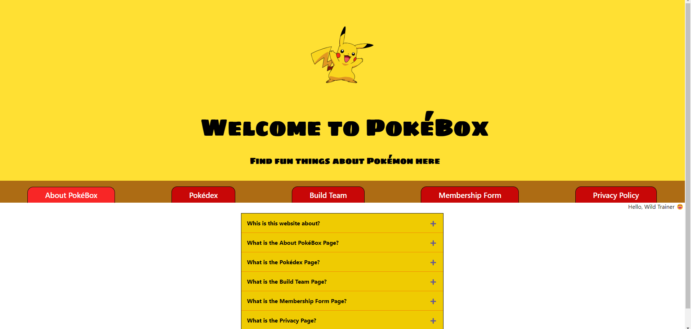

#### Project Description

This is a SPA project based on React.js. It has five views, About Page, Pokedex Page, Team Build Page, Form Page, and Policy Page.
- In About Page, I write a Accordion UI, to explain how to use my website.
- In Pokedex Page, I will load 20 pokemons every time, user can use button to view the previous (if available) 20 pokemons or next 20 pokemons.
- In Team Build Page, user can build their own team by entering the pokemon id.
- In Form Page, user can sign up to become website membership, and after submitting their information, I will store their infomation in state and display their user name.
- In Policy Page, it a fake policy agreement, I add skiplink in this page for quick navigation.

#### How to run
Clone the repo.
```
npm install
npm run build
npx serve -s build
```



#### Complex UI Elements
I use 5 complex UI in this project.
1. In Main Page, I use a Tab UI to navigate between five views.
2. In About Page, I use an accodion UI to introduce basic information.
3. In Pokedex Page, I use a dynamic list UI to fetch the pokedex and display pokemon with relevant color.
4. In Team Page, I use a Form and Card UI to allow user enter and then display specific pokemon.
5. In Form Page, I use a Form with validation.

#### Loading Indicator 
I use three loading indicators in this project.
1. The first loading indicator in Pokedex page, it will show when our project to fetch 20 pokemons data form pokeapi.
2. The secont loading indicator also in Pokedex page, it will show after we fetch the 20 pokemons data and need to fetch data for each single pokemon.
3. The third loading indicator in Team Build page, it will show after user enter pokemon name or id.

#### License Terms
I use two fonts from Google Fonts, the Fonts links are:
- https://fonts.google.com/specimen/Sigmar+One?query=sigma#standard-styles
- https://fonts.google.com/specimen/Beau+Rivage

I use three Loading Indicators from css.gg, the Indicators links are:
- https://css.gg/spinner-alt
- https://css.gg/spinner-two-alt
- https://css.gg/loadbar-sound

I will one image from freepngimg.com as my logo, the image link:
- https://freepngimg.com/png/20048-pikachu-hd

I also use one favicon from uxwing.com, the favicon link:
- https://uxwing.com/pokemon-icon/

All of the assets I mentioned above and used in my project, the license says it is allowed to free use, at least it is allowed to free use in personal project. The license details are:
- https://css.gg/doc/licence
- https://scripts.sil.org/cms/scripts/page.php?site_id=nrsi&id=OFL
- https://creativecommons.org/licenses/by-nc/4.0/
- https://uxwing.com/license/

